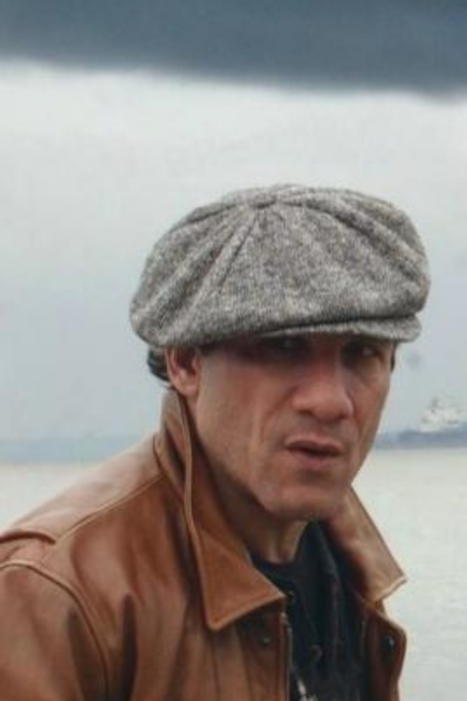
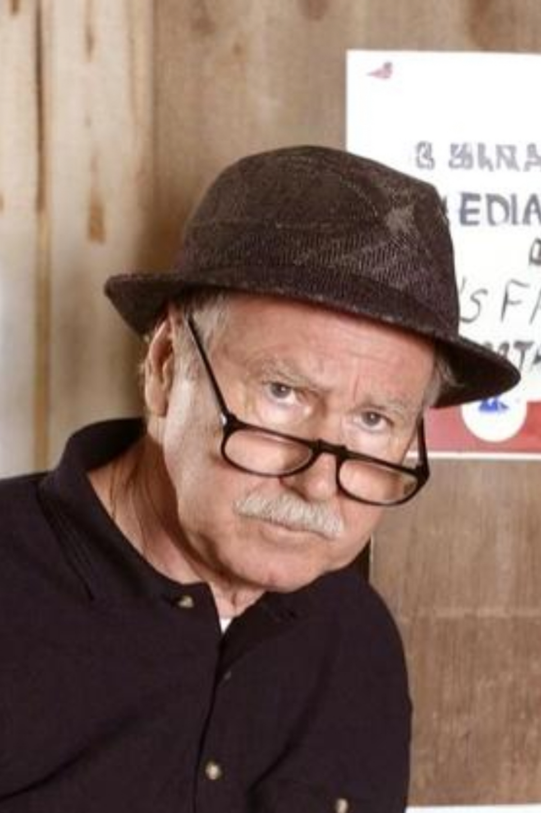

# Spiros and The Greek

Printable photo size images of Spiros Vondas and "The Greek" from the [The Wire](https://en.wikipedia.org/wiki/The_Wire).

| Spiros Vondas                           | "The Greek"                     |
|-----------------------------------------|---------------------------------|
|  |  |

## Development method

### Spiros Vondas

1. Downloaded `Spiros_Vondas.jpg` from somewhere on the internet (didn't record where unfortunately)
2. Extended the top of the image by "uncropping" it with <https://www.pixelcut.ai/ai-image-editor?tool=uncrop> and saved the result as `Spiros_Vondas_uncropped.jpg`
3. In [Inkscape](https://inkscape.org/):
    1. Created a new document sized 4 x 6 inches
    2. Imported `Spiros_Vondas_uncropped.jpg`
    3. Scaled the image so that Spiros fit with just a bit of background showing too
    4. Cropped the image to 4 x 6 inches
    5. Exported the image as `Spiros_Vondas_4x6.png` and `Spiros_Vondas_4x6.pdf` at 300 DPI
    6. Saved the Inkscape document as `Spiros_Vondas_4x6.svg`

### "The Greek"

1. Downloaded `The_Greek_The_Wire.jpg` from somewhere on the internet (didn't record where unfortunately)
2. Extended the top of the image by "uncropping" it with <https://www.pixelcut.ai/ai-image-editor?tool=uncrop> and saved the result as `The_Greek_uncropped.jpg`
3. In [Inkscape](https://inkscape.org/):
    1. Created a new document sized 4 x 6 inches
    2. Imported `The_Greek_uncropped.jpg`
    3. Scaled the image so that The Greek fit with just a bit of background showing too
    4. Cropped the image to 4 x 6 inches
    5. Exported the image as `The_Greek_4x6.png` and `The_Greek_4x6.pdf` at 300 DPI
    6. Saved the Inkscape document as `The_Greek_4x6.svg`
